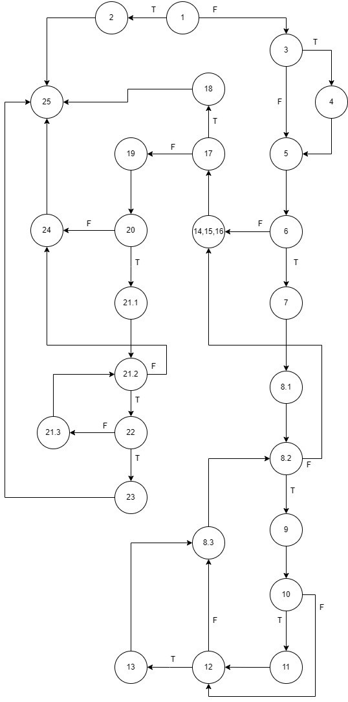

# SI_2023_lab2_215072
## Христијан Делиѓорѓиев, индекс бр. 215072
### Control Flow Graph
[Слика од CFG](https://imgur.com/a/pBCTTi9), алтернативно: 

### Цикломатска комплексност
Цикломатската комплексност на овој код е 11 и истата може да се добие како функција на сите предикатни јазли во кодот (во случајов 10) плус еден.
### Тест случаи според Every branch
Според Every branch (посета на сите исходи во секој предикатен јазол) потребни се најмалку 4 тест-случаеви. [Слика](https://imgur.com/a/H5kzyc6) од тоа на кој начин ги добив истите (не е веќе важечка, тогашните C и D се спојуваат во едно). Тест случаите се:
- A: user = null, allUsers = null
- B: user (null, "p@ssword!", "hristijan@mail.com"); allUsers ("username123", "password.", "hristijan@mail.com") 
- C: user (null, "passw ordd", "hristijan@mail.com"); allUsers {("username123", "password.", "KRistijan@mail.com"),  ("hristijan@mail.com", "password.", "hristijan@mail.com")}
- D: user ("deligjorgjiev", "deli", "hristijan at mail dot com"); allUsers = null

Во А се проверува случајот на исклучок кога има null корисник (или корисник со null email или лозинка). Во B се проверува случај кога работиме без зададено корисничко име (се користи email адресата како корисничко име), и постои корисник со иста адреса како и новиот корисник. Лозинката е во целост добра (нема празно место, не го содржи корисничкото име, има барем 8 знаци, содржи специјален знак). Во C се разгледува случај со два корисници во постоечката низа и додавање на корисник со null име и празно место во лозинка. Со првиот корисник нема совпаѓања на името и email-от, а со вториот има совпаѓања и на двете, и во D разгледуваме случај каде имаме зададено корисничко име, имаме невалидна адреса и имаме прекратка лозинка (или може да имаме лозинка што го содржи корисничкото име). Во овој и првиот случај за низата allUsers не мора да имаме корисник зашто никаде не вршиме споредба на атрибутите на корисниците.
### Тест случаи според Multiple Condition
Доволни се 4 случаеви, бидејќи се работи за if-јамка со три услови разделени со логичко или. Така, доволно е да се падне на првиот услов (Txx), на вториот (FTx), на третиот (FFT), или да не се падне воопшто (FFF)
- A: user = null
- B: user ("username123", null, "hristijan@mail.com")
- C: user ("username123", "p@ssword!", null)
- D: user ("username123", "p@ssword!", "hristijan@mail.com")
